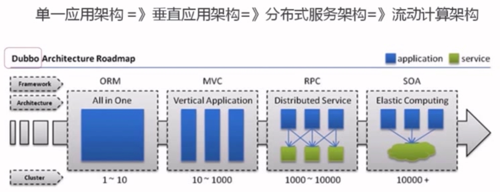
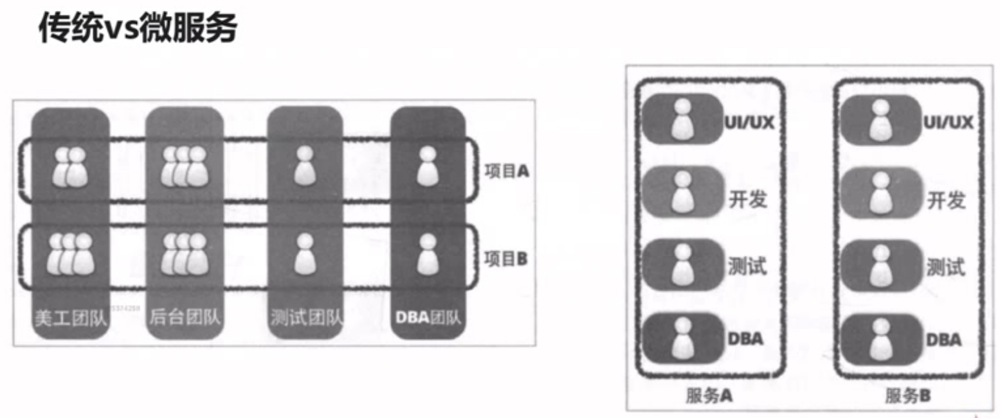
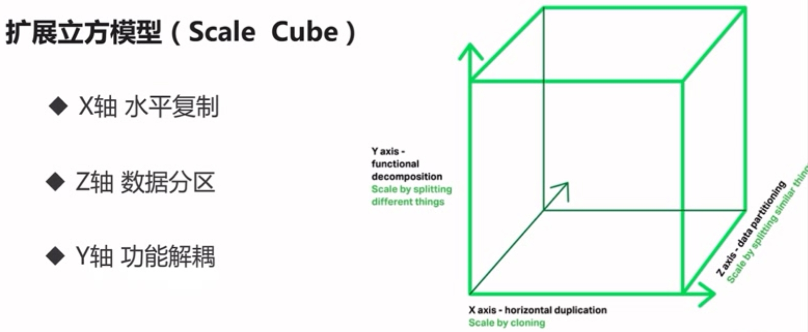
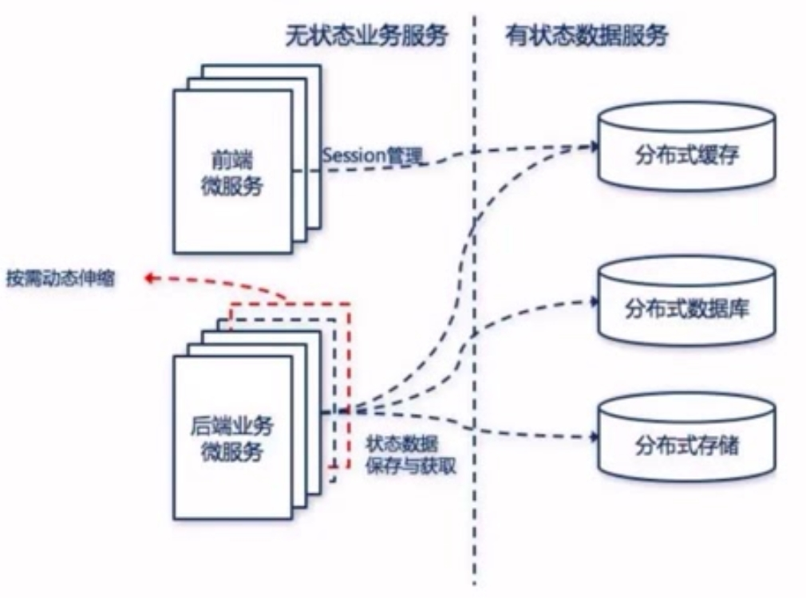
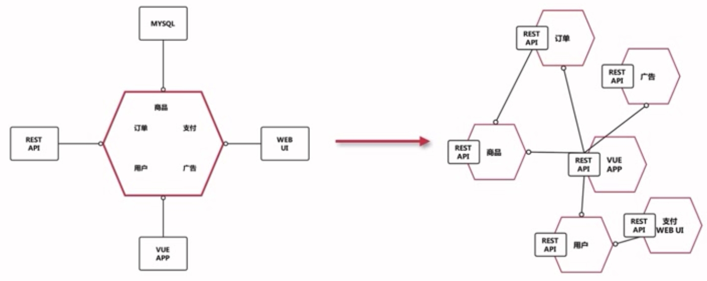

> by Yuanwl

# spring-cloud 学习

主要学习慕课网廖师兄的 spring-cloud 实战课程，另外再参考尚硅谷、动脑架构师课程。代码主要是基于廖师兄的微信点餐服务系统，做一些补充、增强、修改。

## 一、什么是微服务？

微服务英文名称 MicroService，微服务架构模式就是将整个Web应用组织为一系列小的Web服务。这些小的Web服务可以独立地编译及部署，并通过各自暴露的API接口相互通讯。它们彼此相互协作，作为一个整体为用户提供功能，却可以独立地进行扩展。

跟微服务相对应的是将功能从开发到交付都打包成一个很大的服务单元，一般称之为Monolith，也称「巨石」架构。

微服务实现和实施思路更强调功能单一，服务单元小型化和微型化，倡导将服务粒度做小，使它可以独立承担对外服务的职责。


## 二、微服务架构需要的功能或使用场景

1. 我们把整个系统根据业务拆分成几个子系统，简单来说这些子系统有两类功能：提供接口、调用接口。我们将每一个这样的子系统称为一个“微服务”。

2. 每个子系统可以部署多个应用实例（就是多台机器，且会动态扩容，IP不固定），多个应用之间使用负载均衡。

3. 需要一个服务注册中心，所有的服务都在注册中心注册，负载均衡也是通过在注册中心注册的服务来使用一定策略来实现。

4. 所有的客户端都通过同一个网关地址访问后台的服务，通过路由配置，网关来判断一个URL请求由哪个服务处理。请求转发到服务上的时候也使用负载均衡。

5. 服务之间有时候也需要相互访问。例如有一个用户模块，其他服务在处理一些业务的时候，要获取用户服务的用户数据。

6. 需要一个断路器，及时处理服务调用时的超时和错误，防止由于其中一个服务的问题而导致整体系统的瘫痪。

7. 还需要一个监控功能，监控每个服务调用花费的时间等。

目前主流的微服务框架：Dubbo、SpringCloud、thrift、Hessian 等。


## 三、spring-cloud 简介

spring-cloud 是基于 spring-boot 实现的一整套微服务框架。他提供了微服务开发所需的配置管理、服务发现、断路器、智能路由、微代理、控制总线、全局锁、决策竞选、分布式会话和集群状态管理等组件。最重要的是，跟 spring-boot 框架一起使用的话，会让你开发微服务架构的云服务非常方便。

### spring-cloud 组件架构


**spring-cloud子项目包括：**

- Spring Cloud Config：配置管理开发工具包，可以让你把配置放到远程服务器，目前支持本地存储、Git以及Subversion。

- Spring Cloud Bus：事件、消息总线，用于在集群（例如，配置变化事件）中传播状态变化，可与Spring Cloud Config联合实现热部署。

- Spring Cloud Netflix：针对多种Netflix组件提供的开发工具包，其中包括Eureka、Hystrix、Zuul、Archaius等。

- Netflix Eureka：云端负载均衡，一个基于 REST 的服务，用于定位服务，以实现云端的负载均衡和中间层服务器的故障转移。

- Netflix Hystrix：容错管理工具，旨在通过控制服务和第三方库的节点，从而对延迟和故障提供更强大的容错能力。

- Netflix Zuul：边缘服务工具，是提供动态路由，监控，弹性，安全等的边缘服务。

- Netflix Archaius：配置管理API，包含一系列配置管理API，提供动态类型化属性、线程安全配置操作、轮询框架、回调机制等功能。

- Spring Cloud for Cloud Foundry：通过Oauth2协议绑定服务到CloudFoundry，CloudFoundry是VMware推出的开源PaaS云平台。

- Spring Cloud Sleuth：日志收集工具包，封装了Dapper,Zipkin和HTrace操作。

- Spring Cloud Data Flow：大数据操作工具，通过命令行方式操作数据流。

- Spring Cloud Security：安全工具包，为你的应用程序添加安全控制，主要是指OAuth2。

- Spring Cloud Consul：封装了Consul操作，consul是一个服务发现与配置工具，与Docker容器可以无缝集成。

- Spring Cloud Zookeeper：操作Zookeeper的工具包，用于使用zookeeper方式的服务注册和发现。

- Spring Cloud Stream：数据流操作开发包，封装了与Redis、Rabbit、Kafka等发送接收消息。

- Spring Cloud CLI：基于 Spring Boot CLI，可以让你以命令行方式快速建立云组件。


### SpringCloud 特点

1. 约定优于配置；
2. 开箱即用、快速启动；
3. 适用于各种环境；
4. 轻量级的组件；
5. 组件支持丰富，功能齐全；


## spring-cloud vs dubbo

？？

## 微服务怎么拆分

（课程4-1）

多上网查查研究怎么拆分？？

### 先明白起点和终点

- 起点：旧框架做的项目要改成微服务——可行性、合不合适？新项目直接上微服务——上手难度以及可能会遇到的坑？团队结构、成员技术栈如何——能不能上微服务？
- 终点：好的架构不是设计出来的，是进化而来的，而且一直在演进。



### 需要考虑的因素与坚持的原则

- 业务形态不适合的有：
    - 系统中包含很多强事务的场景；
    - 业务相对稳定，迭代周期很长的；
    - 访问压力不大，可用性要求不高的；

- 康威定律：仍会组织在设计一套系统时（广义上的系统），所交付的设计方案在结构上都与该组织的沟通结构保持一致。意思就是，沟通的问题会影响系统的设计。大型微服务架构在实战过程中，一般每个微服务都会由不同的团队开发，这样不同团队之间的沟通可能就会影响整体架构的开发进度。



- 服务拆分方法论：

    

    - 水平复制：就是同样的服务运行多个实例，扩容；
    - 数据分区：每个服务器运行的代码是一样的，但是负责不同的数据子集；
    - 功能解耦：将不同职责的模块分成不同的服务；

综上所述，可知微服务划分的重点就是功能和数据。

- 如何拆分功能？
    - 单一职责、松耦合、高内聚；
    - 关注点分离：
        - 按职责：比如拆分成订单、商品等服务；
        - 按通用性：比如与业务无关的短信服务、消息服务等，应该拆分出来；
        - 按粒度级别：要把握粒度大小，比如前期订单服务一个模块即可，但是后期可能要拆成订单+支付服务；

- 服务和数据的关系：
    - 先考虑业务功能，再考虑数据；
    - 无状态服务：如果一个数据要被多个服务共享，才能完成请求，那么这个数据可以被称之为状态。依赖状态数据的服务，称之为有状态服务，反之是无状态服务。在微服务中，我们要把有状态服务改成无状态服务：

    

- 如何拆分数据？（课程4-12）
    - 每个微服务都有自己独立的数据存储；
    - 依据服务特点选择不同结构的数据库类型，比如弱事务丰富类型的服务可以选择MongoDB，强事务选择MySQL；
    - 难点在确定边界：
        - 针对边界设计api；
        - 依据边界权衡数据冗余；


### 以微信点餐服务系统为例实践微服务拆分

首先要思考拆分的必要性。如果是个人开发，业务很少、规模很小的项目，完全没必要拆分。

如果是团队项目，那就要考虑前后端的技术栈。比如前端熟练使用restful，那可以按终端拆分成手机端、PC端，然后把app做成前后端分离，单独给app提供一个微服务；pc端也可以做成这样，或者用thymeleaf、freemarker等模板引擎来做。

然后，业务发展到一定程度后，要扩容，提高性能，那就可以考虑把后端按业务拆分成订单、商品、支付等微服务等等。

最后，本系统将拆分成以下微服务架构：



要记住微服务架构设计不是一步到位的，因为不是谁都能保证一次就设计准确。要渐进式的演变，先把迫切要拆分的拆出来，部署到生产环境，后面再拆分其他模块——微服务就是要低成本、低风险、渐进式的演进。

## 学习笔记结构

主要分以下几大部分：

- [eureka](eureka)：


源码获取：要获取特定章节的源码，可以用以下命令

```git
# 后面的 4-12 表示第 4-12 和之前的源码打成的tag，前面的 4-12 表示把远端代码拉到本地打成 4-12 的tag
git checkout -b 4-12 4-12
```