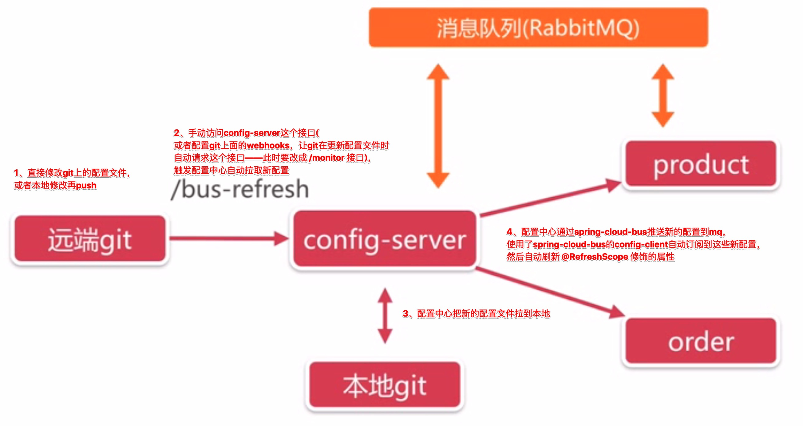

> by Yuanwl

# 配置中心作用和原理


# 使用配置中心步骤

## 服务端

1. 引入主要依赖：
```
<!--配置中心服务端依赖-->
<dependency>
    <groupId>org.springframework.cloud</groupId>
    <artifactId>spring-cloud-config-server</artifactId>
</dependency>

<!--配置中心也是一个微服务，需注册到注册中心给其他人调用-->
<dependency>
    <groupId>org.springframework.cloud</groupId>
    <artifactId>spring-cloud-starter-netflix-eureka-client</artifactId>
</dependency>
```

1. 在启动类加上主要注解：@EnableConfigServer //启动配置中心服务端；

1. 在项目配置文件里配置好 git 项目（下面创建的项目）路径、用户名、密码等信息；

1. 启动项目，把配置中心服务端注册到 eureka 即可；

**建议：配置中心要保持高可用——多启动几个实例即可，eureka 会帮忙组建高可用集群。**


## 配置中心配置文件名访问规则

把配置中心服务端启动后，访问 http://localhost:8300/{label}/{name}-{profiles}.yml 即可访问到配置，其中：

- label：分支，不写就是 master；
- name：微服务名；
- profiles：环境；

**注意：如果访问 order-dev.yml，实际得到的结果是配置中心把 order.yml 和 order-dev.yml 合并之后的，所以我们一般把通用配置放到 order.yml，把对应环境的配置放在 -dev、-test、-prod 里，以免配置冲突。**


## 客户端

1. 在某个需要配置的项目，比如 product、order，引入主要依赖：
```
<!--配置中心客户端依赖-->
<dependency>
    <groupId>org.springframework.cloud</groupId>
    <artifactId>spring-cloud-config-client</artifactId>
</dependency>

<!--配置中心也是一个微服务，需注册到注册中心给其他人调用-->
<dependency>
    <groupId>org.springframework.cloud</groupId>
    <artifactId>spring-cloud-starter-netflix-eureka-client</artifactId>
</dependency>
```

1. 启动类无需加配置中心相关的注解；

1. 创建 bootstrap.yml，把微服务名、注册到 eureka、发现 config 微服务的配置移到这里来，保证在 spring 上下文创建前就加载这个配置文件；

1. 去码云或者其他 git 托管网站，或者自建公司内网托管，创建 git 项目，把其他配置丢项目里面；

1. 先启动 eureka-server，再启动 config，最后再启动客户端项目即可；

**注意：git 项目里的配置文件名必须与微服务名对应，否则会找不到配置文件报错！另外，每次改动配置，都要重启 config，客户端才能生效——不重启就让配置生效在下节讲。**


# 结合 webhooks 实现配置实时生效

使用 spring-cloud-bus + git 的 webhooks 实现这个效果，流程：



## 配置中心

1. 引入主要依赖：
    ```xml
    <!--spring-cloud消息总线-->
    <dependency>
        <groupId>org.springframework.cloud</groupId>
        <artifactId>spring-cloud-starter-bus-amqp</artifactId>
    </dependency>

    <!--用来监视git的webhooks的请求，除非后续一系列的配置更新-->
    <dependency>
        <groupId>org.springframework.cloud</groupId>
        <artifactId>spring-cloud-config-monitor</artifactId>
    </dependency>
    ```

1. 在本项目 application.yml 加上：
    ```yml
    # 把所有端点都暴露出来，包括 /actuator/bus-refresh
    management:
      endpoints:
        web:
          exposure:
            include: "*"
    ```

1. 去上文的git项目里，配置 webhooks，利用外网映射到本项目的 /monitor 接口，比如我配置的是：http://3d934r.natappfree.cc/monitor；

1. 在配置中心客户端项目需要自动刷新的属性累上面加上 @RefreshScope 注解——就是那些有用到 @Value、@@ConfigurationProperties 的类；

1. 启动项目，修改git项目的配置文件，看看配置有没有自动刷新；

**注意：过程中碰到以下两个问题**

1. 手动发送 post 请求到 /actuator/bus-refresh 可以刷新配置，在 webhooks 上配置这个请求就报错：用下面的方法（https://blog.csdn.net/m0_37556444/article/details/82812816``）；
1. 默认情况下没有 /monitor 接口，访问报404：要在pom里加入依赖 spring-cloud-config-monitor ——虽然没报错了，但是客户端没有自动刷新配置？？