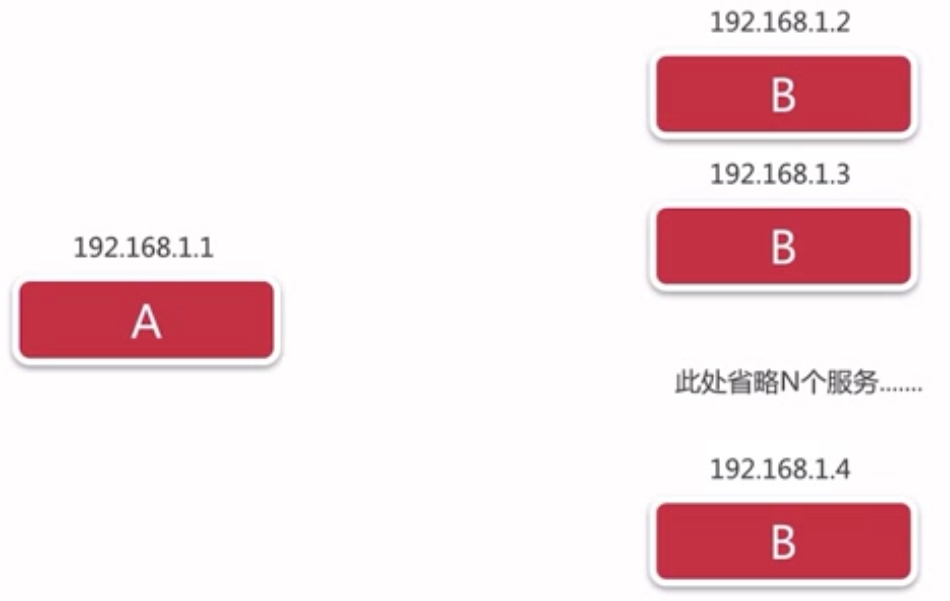
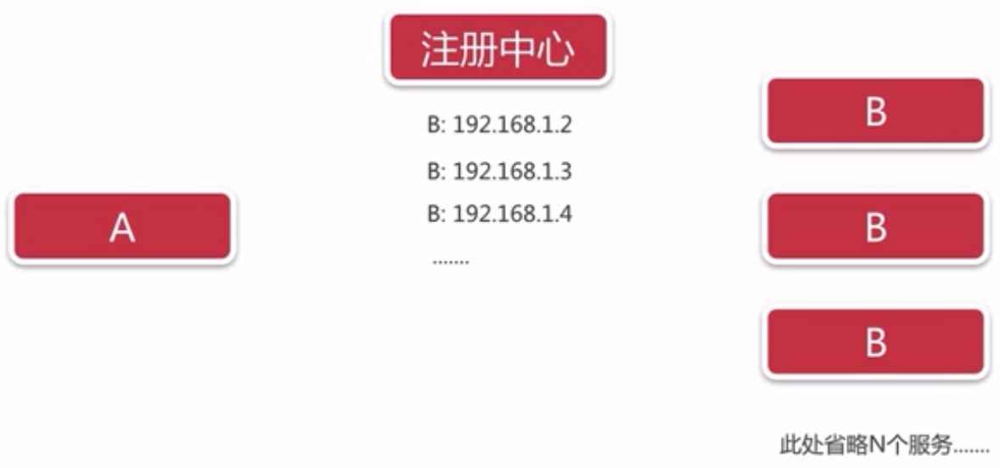

> by Yuanwl

# eureka

eureka 提供服务注册、服务发现、高可用、心跳检测、健康检查、负载均衡等功能——分布式系统中，服务注册中心是最重要的基础部分。

## eureka-server

1. 引入主要依赖：
    ```java
    <dependency>
        <groupId>org.springframework.cloud</groupId>
        <artifactId>spring-cloud-starter-netflix-eureka-server</artifactId>
    </dependency>
    ```
2. 启动类上面加上注解 @EnableEurekaServer；
3. 配置 application.yml；
4. 启动启动类，访问 http://localhost:8761/ 就可以看到eureka监控面板;

## eureka-client

1. 引入主要依赖：
    ```java
    <dependency>
        <groupId>org.springframework.cloud</groupId>
        <artifactId>spring-cloud-starter-netflix-eureka-client</artifactId>
    </dependency>
    <!--如果不加上下面这个依赖，eureka客户端启动后会自动关闭-->
    <dependency>
        <groupId>org.springframework.boot</groupId>
        <artifactId>spring-boot-starter-web</artifactId>
    </dependency>
    ```
2. 启动类上面加上注解 @EnableEurekaClient 或 @EnableDiscoveryClient——推荐后者，详情看注释；
3. 配置 application.yml；
4. 先启动 eureka-server，再启动本启动类，访问 http://localhost:8761/ 就可以在 “Instances currently registered with Eureka” 一栏看到本服务已注册;


## 高可用

1. 在 eureka-server 的 application.yml 的 defaultZone，配置所有的服务端节点，然后启动多个服务端，让服务端互相注册，组成高可用集群；
2. 在 eureka-client 的 application.yml 的 defaultZone，配置所有的服务端节点，然后启动客户端，同时注册到这些服务端去，这样可以实现：

- 只要有一个服务端还在运行中，客户端就可以注册成功；
- 如果某个服务端挂了，期间又有新的客户端注册，此服务端重新启动后，理应没有这个客户端信息——然而，因为服务端集群之间会互相同步信息，所以可以把这个客户端信息同步过来；
- 客户端挂掉后，集群中所有服务端都会剔除之，但不是马上，而是在下一次心跳检测不通过时；


## 源码解读
？？

## 分布式系统中服务注册与发现的地位和原理

### 分布式系统为什么需要服务注册与发现？

首先，假如有这样的分布式系统：



如果a要调用b集群中的一个b，那就需要在a这边配置所有b的ip、端口，然后用轮询、哈希等负载均衡的方式，挑出一个b来调用。这么做有几个问题：

1. b是动态扩容的，那每增减一个b，都要修改a的配置，然后重启吗？
2. 如果b集群在运行过程中，有某台挂掉了，然后a刚好要调用它，那就会报错！

为了解决以上问题，注册中心就产生了：



所有b在启动时，就把自己注册到注册中心。注册中心维护b集群信息，如果某个b挂掉了，就在注册表里把它剔除掉。这样a就可以通过注册中心调用b了。

所以，由此可见，注册中心非常重要，是分布式系统中最重要的基础部分，要保持高可用状态，因为如果它挂了，所有微服务都变成了无头苍蝇！

那么，a具体是怎么找到要调用的b呢？有两种方式：

### 服务发现的方式

**客户端发现：** 先从注册中心获取到所有的b，然后用轮询、哈希或者其他负载均衡的方式来挑选出一个b。比如 eureka 就是用这种方式。

- 优点：简单直接，可以拿到所有b的信息；
- 缺点：a要自己实现一套逻辑把b挑出来；

**服务端发现：** 代理帮a从b集群中挑选出一个b，给a。比如 nginx、zookeeper、kubernetes 等就是用这种方式。

- 优点：b和注册中心对a是透明的，a只需要找代理拿b；
- 缺点：？？

微服务架构通常来说是异构的（包含不同的语言，每个微服务可能还用不同的数据库），选用哪种方式，要看你实现微服务的难易程度、性能影响等等。