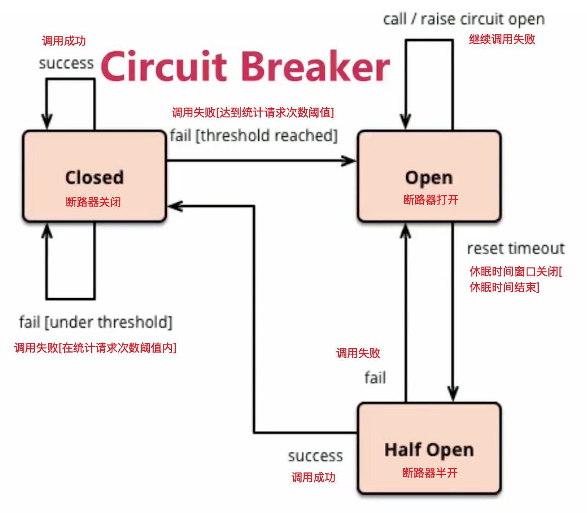

> by Yuanwl

# hystrix 学习


## 降级

可以理解为: 调用某服务没有响应时, 转而调用一个设置好的降级方法, 给用户返回提示信息, 而不是一直等待响应--这个过程就叫降级.

可使用 @HystrixCommand,@DefaultProperties 和降级方法实现降级. 触发降级的条件一般有:

- 调用的服务不可用;
- 调用的服务超时没有响应. 默认只等待1秒, 可通过在 @HystrixCommand 内的 @HystrixProperty 指定等待响应时间;
- 主调用方法内部抛异常;

代码请看: [HystrixController1.java](src/main/java/xyz/yuanwl/demo/spring/cloud/hystrix/controller/HystrixController1.java)


## 熔断

### 依赖隔离

类似于 docker 的舱壁模式把进程隔离开来, hystrix 则把线程池隔离: 某个线程池失去响应, 不会拖慢其他线程池. hystrix 自动为加了 @HystrixCommand 的方法创建这样的线程池.

### 容错

为提高微服务的高可用, 必须容错. 一般有两种方式:

1. 重试: 适用于预期只是短暂的故障, 重试几次就可能成功;
2. 熔断: 如果故障是无法评估的, 可能是长时间, 就应该用这种模式(又叫断路器模式), 把调用服务过程封装在受监控的断路器对象里.

### 熔断(断路器模式)

首先要了解断路器状态机:



1. 断路器默认关闭;
2. 监控: 每 n 次调用计算一次调用失败的比率, 如果在设置的百分比内, 依然关闭断路器, 否则打开断路器;
3. 断路器打开后, 进入休眠时间窗口, 在这时间内, 所有调用都返回降级方法的结果, 即降级方法临时称为主调逻辑;
4. 休眠时间结束后, 断路器进入半开状态, 如果有请求过来, 断路器就让请求到达主调用逻辑, 如果能调用, 就关闭断路器, 进入新一轮的监控计数; 否则, 断路器继续打开, 重新进入休眠时间窗口, 重新计时;

代码请看: [HystrixController2.java](src/main/java/xyz/yuanwl/demo/spring/cloud/hystrix/controller/HystrixController2.java)


## feign 结合 hystrix 使用

步骤:

1. @FeignClient 设置属性 fallback 值为所修饰的接口的实现类: [ProductClient.java](../product/product-client/src/main/java/xyz/yuanwl/demo/spring/cloud/product/client/ProductClient.java). 在实现类的方法里写降级逻辑: 每个降级方法对应接口的同名方法;
1. 主调项目引入 feign 依赖(feign 依赖已经包含 hystrix 依赖);
1. 主调项目配置:
    ```yml
    feign:
      hystrix:
        enabled: true
    ```
1. 在主调项目的启动类加上 @ComponentScan(basePackages = "xyz.yuanwl.demo.spring.cloud"), 扫描本项目的类和第1步的实现类;
1. 在主调项目的启动类加上 @EnableFeignClients 扫描 @FeignClient 所在路径--这一步不要漏了! 否则 FeignClient 不起作用, 只是普通的类;


**注意: 如果被调服务超时, 可能会导致 hystrix 超时(默认1秒), 从而触发降级.为了避免这个问题, 可参考下面两个帖子配置项目:**

- 推荐: https://blog.csdn.net/east123321/article/details/82385816
- https://blog.csdn.net/mxmxz/article/details/84633098


## hystrix-dashboard

1. 主调项目引入依赖:
    ```xml
    <dependency>
        <groupId>org.springframework.cloud</groupId>
        <artifactId>spring-cloud-starter-netflix-hystrix-dashboard</artifactId>
    </dependency>
    <!--使用 hystrix-dashboard 必须要引入这个依赖, 如果已经引入就无需重复引入-->
    <dependency>
        <groupId>org.springframework.boot</groupId>
        <artifactId>spring-boot-starter-actuator</artifactId>
    </dependency>
    ```
2. 配置文件:
    ```yml
    #暴露所有监控端点, 包括 hystrix-dashboard
    management:
      endpoints:
        web:
          exposure:
            include: "*"
          cors:
            allowed-origins: "*"
            allowed-methods: "*"
    ```
3. 启动类加注解: @EnableHystrixDashboard;
4. 启动项目;
5. 在 dashboard 页面输入: http://localhost:8080/actuator/hystrix.stream (注意这里不是 hystrix.stream，springboot2.0 默认是 actuator/hystrix.stream), 点 monitor stream 按钮打开监控页面, 然后开始调用接口观看监控情况;

** 注: 这个东西等以后要用时再详细了解.