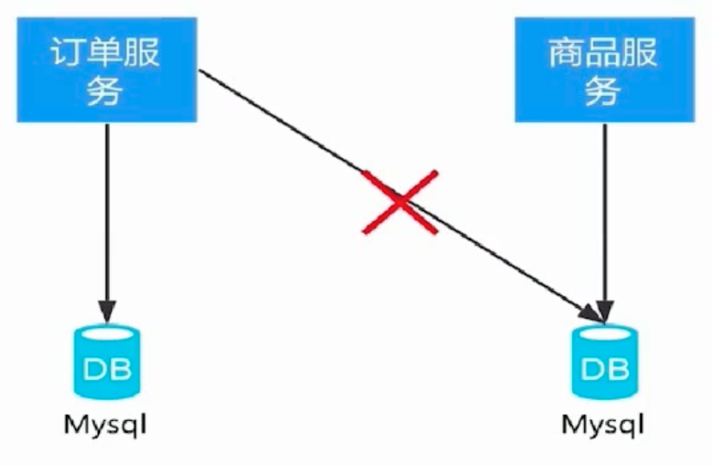
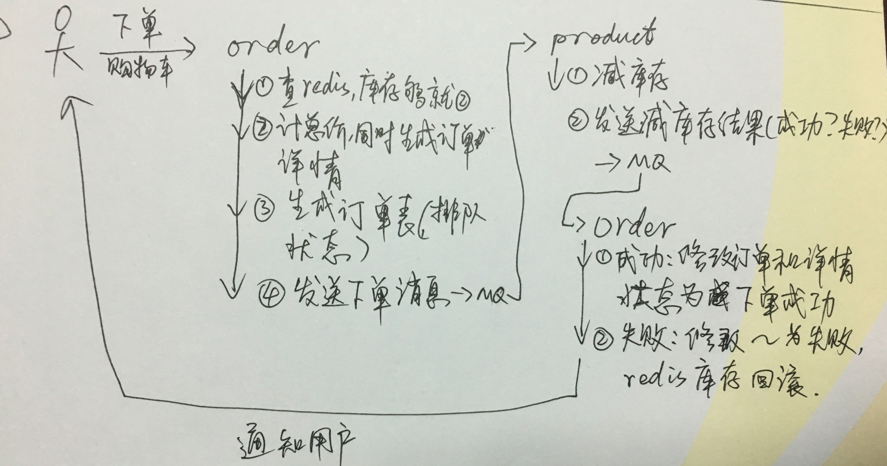

> by Yuanwl

# RestTemplate 调用微服务的三种方式

看：[ClientController.java](order-server/src/main/java/xyz/yuanwl/demo/spring/cloud/order/controller/ClientController.java)


# 客户端负载均衡器 ribbon

eureka 是客户端发现，其负载均衡是软负载，是由 ribbon 客户端负载均衡器实现的，而后者则是 spring-cloud 基于 Netflix-Ribbon 的二次封装。RestTemplate、Feign、Zuul 都用到了 ribbon。

## ribbon 的核心

1. 服务发现：根据服务名拿到实例列表；
1. 服务选择规则：依据规则策略从实例列表中选出合适的有效实例；
1. 服务监听：剔除失效的服务；

## ribbon 的主要流程

1. ServerList：获取所有可用实例列表；
1. ServerListFilter：过滤掉一部分地址；
1. IRule：选择一个合适的实例；

## ribbon 的主要源码解读

1. org.springframework.cloud.netflix.ribbon.RibbonLoadBalancerClient.choose
1. org.springframework.cloud.netflix.ribbon.RibbonLoadBalancerClient.getServer(java.lang.String)
1. org.springframework.cloud.netflix.ribbon.RibbonLoadBalancerClient.getLoadBalancer
1. com.netflix.loadbalancer.BaseLoadBalancer.getAllServers
1. com.netflix.loadbalancer.BaseLoadBalancer.chooseServer：
    ```java
    public Server chooseServer(Object key) {
        if (this.counter == null) {
            this.counter = this.createCounter();
        }

        this.counter.increment();
        if (this.rule == null) {
            return null;
        } else {
            try {
                return this.rule.choose(key); //这里的rule，默认是RoundRobinRule，也就是轮询负载均衡规则
            } catch (Exception var3) {
                logger.warn("LoadBalancer [{}]:  Error choosing server for key {}", new Object[]{this.name, key, var3});
                return null;
            }
        }
    }
    ```

我们可以在 application.yml 设置用哪种负载均衡规则（一般不用设置）。


# feign 的使用

feign 也是基于 ribbon 的客户端负载均衡机制，和 RestTemplate 相比，形式上更像 rpc 调用。

注意：以下代码是在调用端，即 feign 客户端写的，在本项目就是 order：

1. 引入主要依赖：
```
<dependency>
    <groupId>org.springframework.cloud</groupId>
    <artifactId>spring-cloud-starter-feign</artifactId>
</dependency>
```
2. 启动类 xyz.yuanwl.demo.spring.cloud.order.OrderApp 上加注解：@EnableFeignClients //启用feign客户端，扫描标记了 @FeignClient 注解的类；
3. 编写调用微服务接口的客户端类：xyz.yuanwl.demo.spring.cloud.order.client.ProductClient；
4. 调用 ProductClient：xyz.yuanwl.demo.spring.cloud.order.controller.ClientController.orderGetProductMsgByFeign；

综上所述，不难发现：

- feign 是声明式 rest 客户端（伪 rpc，但本质上还是http）；
- feign 采用了基于接口的注解；

# 项目改成多模块

1. order-common：公共的对象；
2. order-server：所有业务逻辑；
3. order-client：对外暴露的接口；

1被2、3依赖。


# 在商品和订单服务中使用 mq

已实现的下单流程是:

1. 参数检验
2. 查询商品信息(调用商品服务)
3. 计算总价(顺便生成订单详情)
4. 扣库存(调用商品服务)
5. 订单入库(生成订单主表)

这5步是顺序调用, 即同步调用的过程. 如果只是下单-扣库存业务结合 mq 改造成异步调用, 思路如下:


代码见:

1. 减库存: xyz/yuanwl/demo/spring/cloud/product/service/impl/ProductServiceImpl.java#decreaseStock(List<DecreaseStockInput> decreaseStockInputList);
2. 缓存库存: xyz/yuanwl/demo/spring/cloud/order/msg/ProductInfoReceiver.java#process(String msg);


现在为进一步提高性能, 把上面2~4同步调用都改成异步调用, 那么需要做以下重构:

## 1. 分库(未完待续)



## 2. 代码调用流程改造(未完待续)



## 疑问

- redis 锁??
- 分布式锁??
- CAP?? zookeeper 保证 CP?? eureka 保证 ap;

