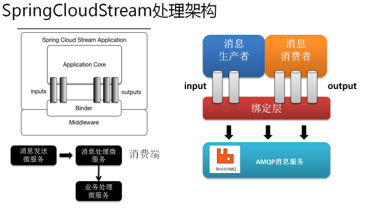

> by Yuanwl

# spring-cloud-stream

SpringCloud Stream 是 SpringCloud 对于消息中间件的进一步封装，它简化了开发人员对于消息队列的操作。目前仅支持 RabbitMQ 与 Kafka：

参考：https://www.cnblogs.com/huangjuncong/p/9102843.html ，我们创建了4个子项目：

- stream/stream-common：放置通用代码；
- stream/stream-producer：生产者；
- stream/stream-consumer1：消费者1；
- stream/stream-consumer2：消费者2；

参考帖子，总结出 stream 有以下几个要点：

1. 可以在代码里自定义信道，或者用已有的 Sink、Source、Processor 的信道；
2. 然后在配置文件定义信道对应的绑定信息，其中 destination 属性才是真正指定消息目的地的；
3. 生产者和消费者以配置文件的 destination 指定的目的地联系起来，生产者通过 output 信道发送消息到这（mq）这来，消费者通过 input 信道从这监听消息；
4. 消费者可以通过 @SendTo 给生产者返回确认消息——按帖子说的测试，没有打印 ack 消息??
5. 绑定同一个目的地的消费者如果不分到同一个组，那么大家都可以拿到同样的消息，否则以轮询的方式消费消息；
6. Processor 结合 @ServiceActivator 可以实现一个消费者把消息中转给另一个消费者的效果；
7. 消息分区??
8. 能不能实现点对点??
9. 同一个目的地，能不能定义多组一一对应的点对点输入、输出信道??即输出a只能被输入a消费??用分区实现??

# 参考资料

- https://www.cnblogs.com/hellxz/p/9396282.html
- https://www.jianshu.com/p/228fa976deb0
- https://www.cnblogs.com/yangzhilong/p/7904461.html
- https://www.jianshu.com/p/67c79c1149df
