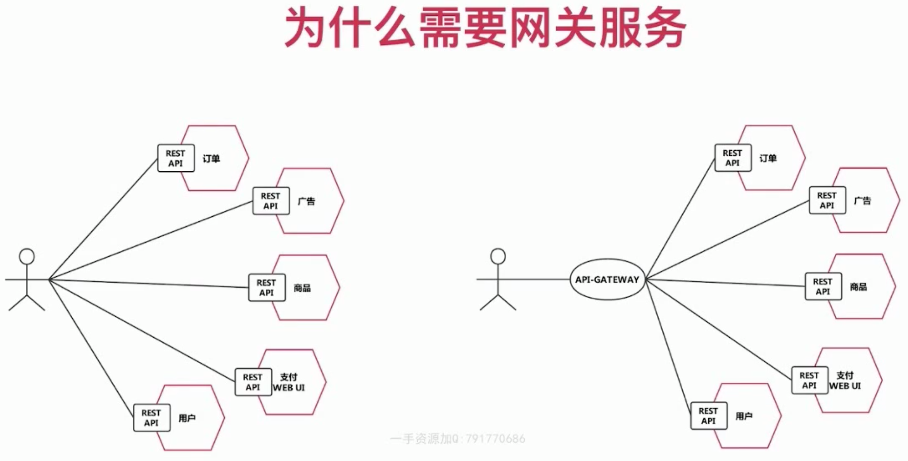
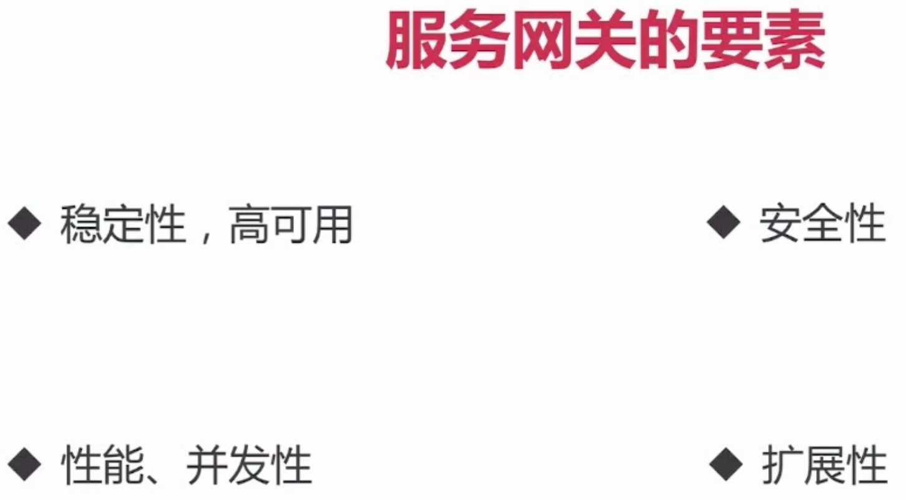
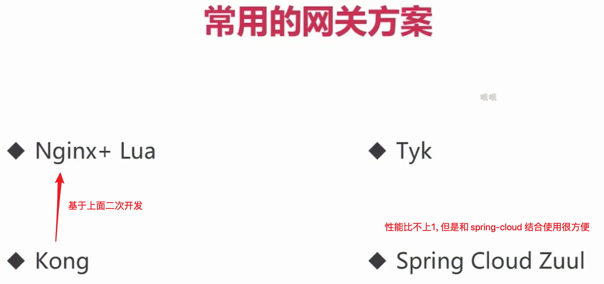
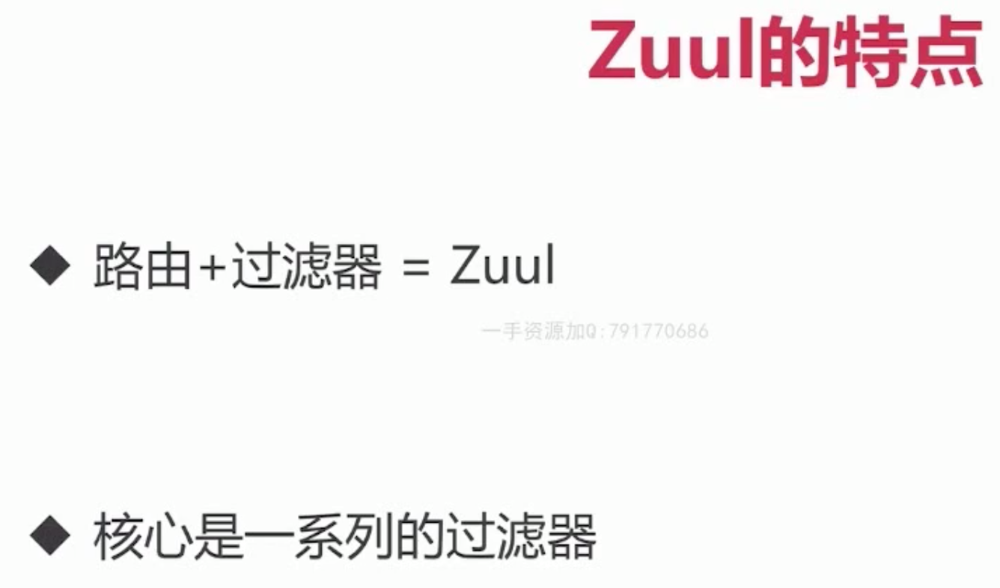
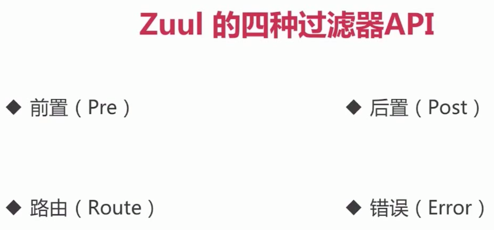
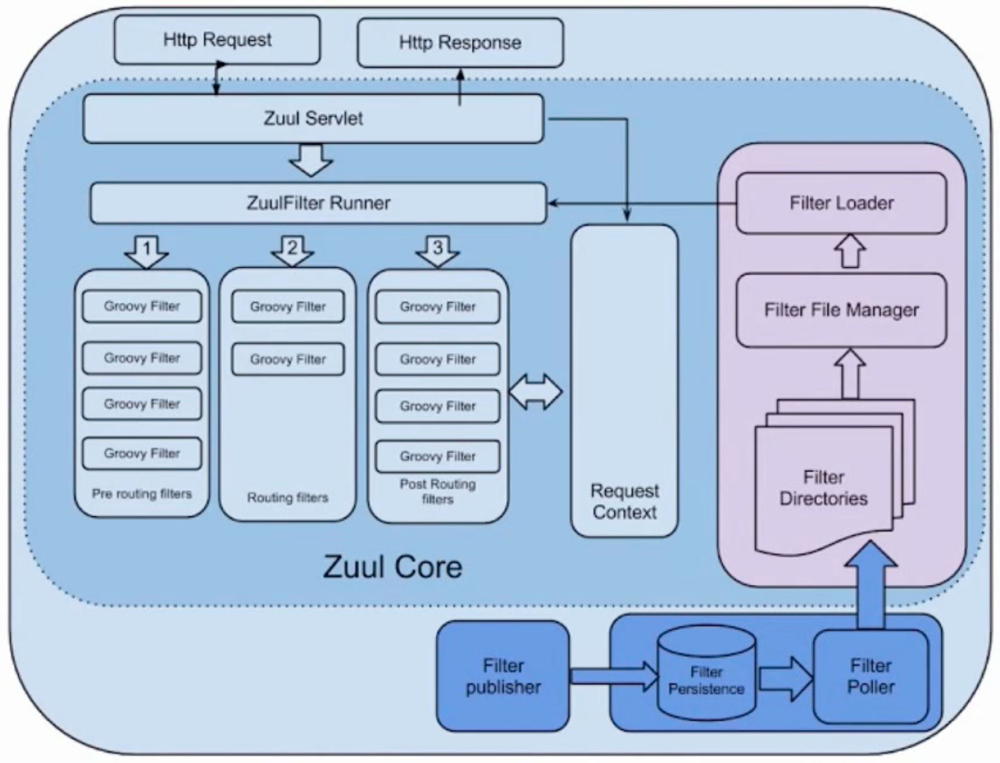
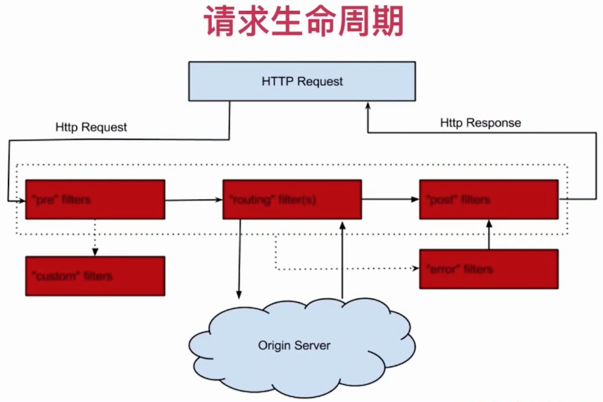
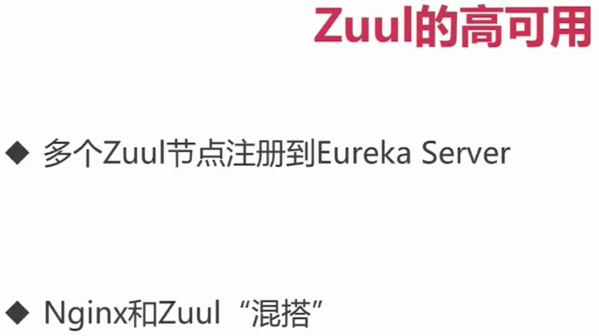

> by Yuanwl

# zuul 网关

## 基础理论知识







有空了解一下 nginx+lua,kong,tyk.












## 简单开发步骤

1. 引入依赖:
```yml
<dependency>
    <groupId>org.springframework.cloud</groupId>
    <artifactId>spring-cloud-starter-netflix-zuul</artifactId>
</dependency>
```
2. 配置(可选);
3. 启动类上面加注解 @EnableZuulProxy //启用 zuul 网关代理;
4. 启动项目即可使用网关;

